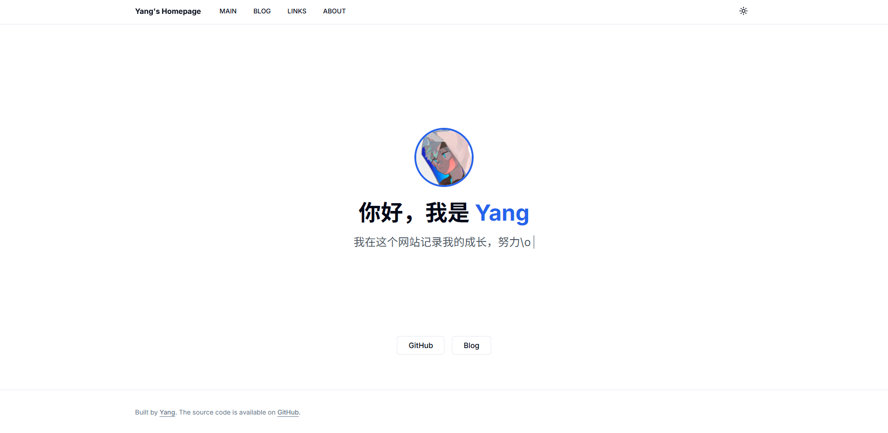

<div align="center">

# 🚀 Kaehei's Homepage

<p align="center">
  
  
  
  
  
</p>

<p align="center">
  <strong>这是我的个人主页项目，基于 <a href="https://nextjs.org/">Next.js</a> + React 19 + Tailwind CSS + Shadcn/ui，Blog部分使用 <a href="https://github.com/st1ven/typecho-api">Typecho Api</a>二次开发而成。</strong>
</p>

</div>

<br/>

## ✨ 主要特性

<table>
<tr>
<td width="25%" align="center">🎨<br/><strong>现代扁平化设计，极简美观</strong></td>
<td width="25%" align="center">📱<br/><strong>响应式布局，移动端友好</strong></td>
<td width="25%" align="center">🔍<br/><strong>SEO 优化，字体预加载</strong></td>
<td width="25%" align="center">🌙<br/><strong>支持深色模式，平滑切换</strong></td>
</tr>
</table>

<br/>

## 🚀 快速开始

<details open>
<summary><strong>安装依赖</strong></summary>

```bash
npm install
```
</details>

<details open>
<summary><strong>启动开发环境</strong></summary>

```bash
npm run dev
```
</details>

<details open>
<summary><strong>访问项目</strong></summary>

[http://localhost:3000](http://localhost:3000)
</details>

<br/>

## 📝 目录结构

```
📦 myblog
├── 📁 src/app          # 页面与路由
├── 📁 src/components   # UI 组件
└── 📁 public           # 静态资源(如头像等)
```

<br/>

## 🖼️ 效果预览

<div align="center">
  
</div>

<br/>

## 📖 相关链接

- [myblog](https://kaeshi.top)
- [Shadcn/ui](https://ui.shadcn.com/)
- [Next.js](https://nextjs.org/)

---

## 📄 License

[Apache-2.0](LICENSE)
