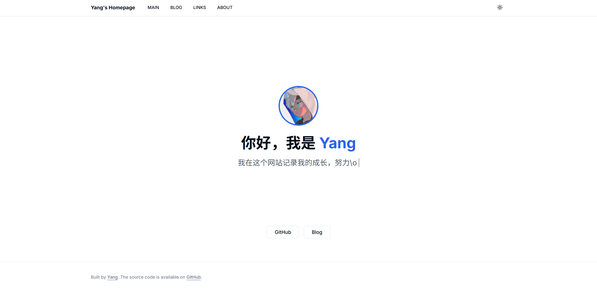

# Kaehei's Homepage

<p align="center">
  
  
  
  
</p>

<br />

<div align="center">
  
</div>

**Make A Dent In The Universe.**  
Minimalist design, fluid animations, and a focus on content.

</div>

<br />

## ✨ Features

- **Zen Modernism**: A clean, distraction-free aesthetic with subtle animations.
- **Responsive**: Perfectly adapted for all devices, from mobile to desktop.
- **Dynamic Content**: Powered by Typecho API for seamless blogging.
- **Interactive**: Smooth transitions powered by Framer Motion.
- **Dark Mode**: Native dark mode support for visual comfort.

## 🛠️ Tech Stack

- **Framework**: Next.js 16 (App Router)
- **Styling**: Tailwind CSS + Shadcn/ui
- **Language**: TypeScript

## 🚀 Quick Start

1.  **Clone the repository**
    ```bash
    git clone https://github.com/Kaehei/homepage.git
    cd homepage
    ```

2.  **Install dependencies**
    ```bash
    npm install
    ```

3.  **Run development server**
    ```bash
    npm run dev
    ```

Open [http://localhost:3000](http://localhost:3000) to view the project.

## 📄 License

This project is licensed under the [Apache-2.0](LICENSE) License.
